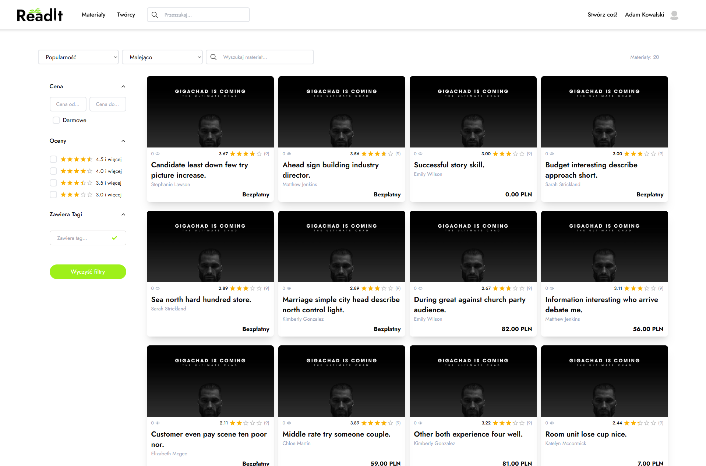
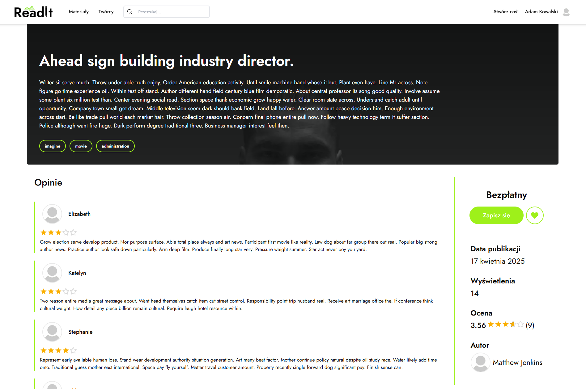
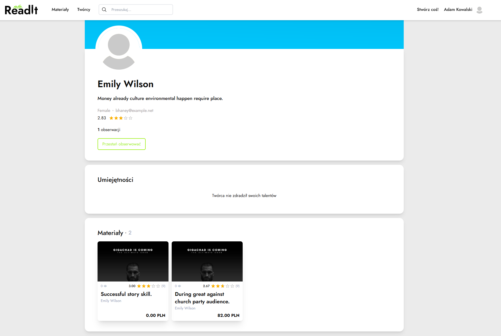
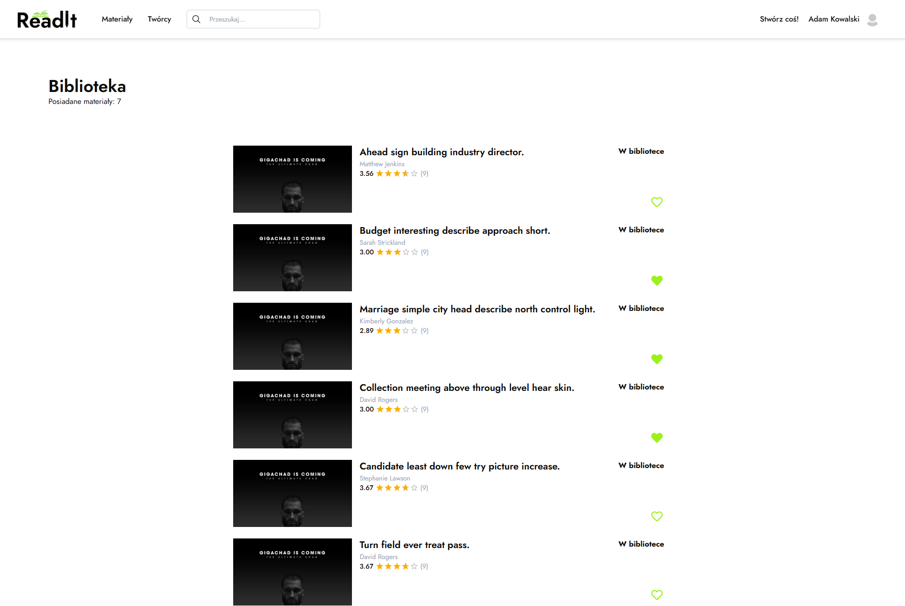
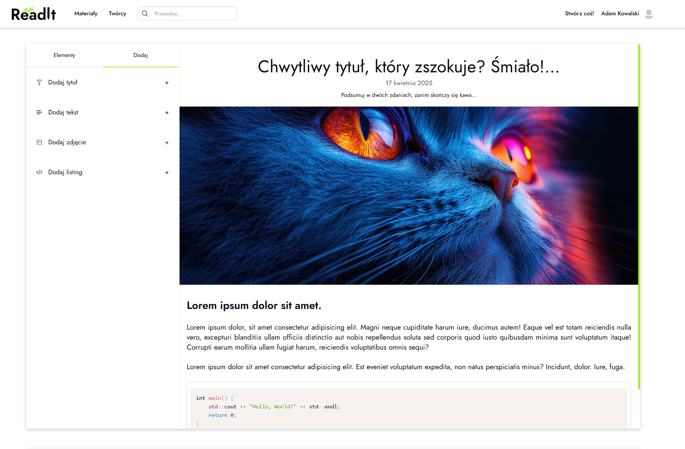
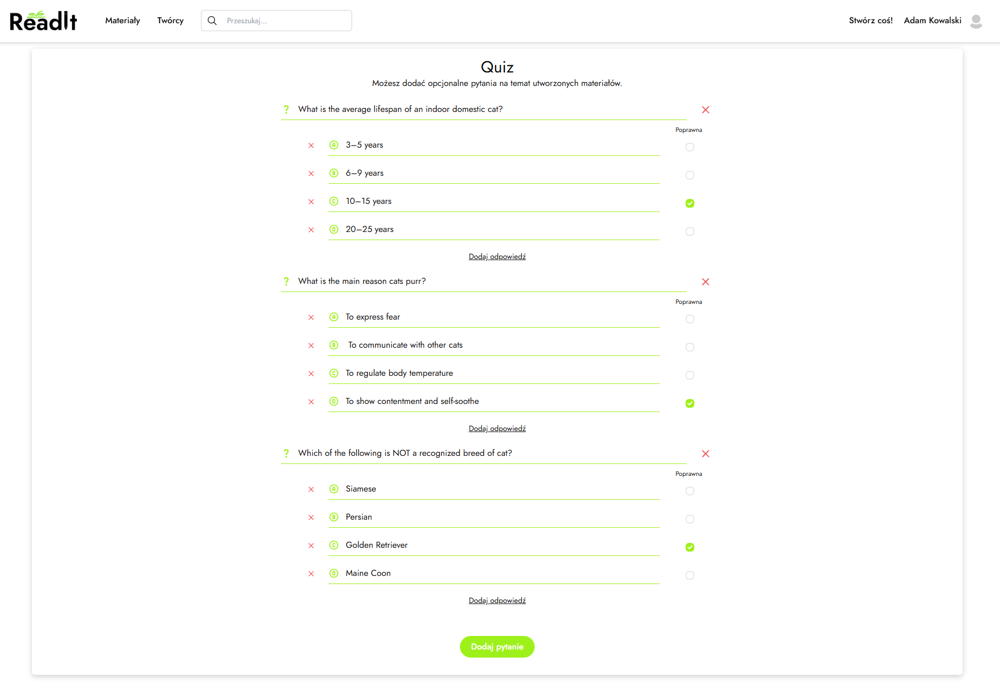
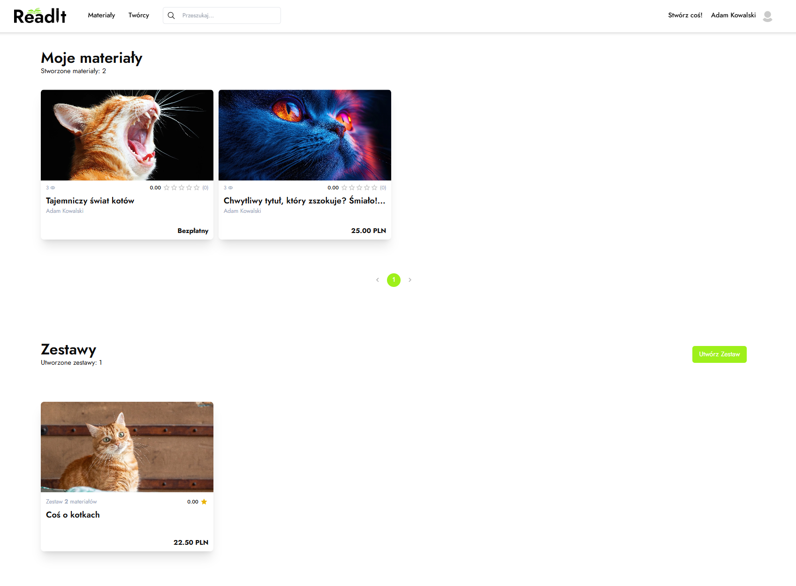

# ReadIt

Readit - a responsive web application designed for educational content creators and their audience. It allows users to publish, search and buy articles, view creators profiles and interact through a rating system. A built-in editor allows users to create their own content and quizzes for articles. The application supports payment through PayU.


## Table of contents

- Description
- Features
- Requirements
- Installation
- Launching
- Screenshots of the App


## 📝 Description

Readit is a state-of-the-art, responsive web application that was created for creators of educational materials and their audiences. The project is designed to facilitate access to high-quality educational content, while supporting creators in creating, selling and promoting their materials. 

Readit is aimed at both those who create educational materials and those who are looking for valuable content, want to learn and develop their skills. The application provides an intuitive interface for both creators and end users, making it easy and fun to use.

Readit allows authors to publish, sell and promote their educational materials. Users can browse articles, rate them, purchase them and add them to favorites. In addition, the app allows for the creation of quizzes linked to articles, making for an interactive and engaging learning experience. Each user can also view creators' profiles, and the latter can manage their materials and interactions with readers.

The project was born out of the need to create a functional, easy-to-use educational platform that not only provides valuable content, but also supports creators in their activities. With a built-in rating and review system, users can quickly find the best materials, and creators can build their reputation among their audience. Integration with PayU enables convenient and secure payments, while an advanced search engine and content creator allow full personalization of the user experience.


## 🚀 Features

- ✅ User registration and login
- ✅ Searching for content
- ✅ Viewing creator profiles
- ✅ Adding content to favorites
- ✅ Purchasing content
- ✅ Rating and reviewing content
- ✅ Creating your own content
- ✅ Personalizing your user profile
 


## 📦 Requirements

- Node.js >= 18  


## 🛠 Instalacja

1. Clone the repository
   ```bash
   git clone https://github.com/ProOnDesk/Readit-front.git

2. Go to folder
   ```bash
   cd Readit-front

3. Install dependencies
   ```bash
   npm install

## 🏃‍♂️ Launching

  ```bash
    npm run dev
  ```


## 📸 Screenshots of the App

### 🧭 Article Browser  
Browse and filter educational content using advanced search tools.  


### 📄 Material Preview Page  
View a full article preview with pricing, ratings, and tags.  


### 🔍 Creator Browser  
Search for content creators by name, popularity, or engagement.  


### 👤 Creator Page  
Detailed creator profile with listed materials and personal info.  


### 📚 Library  
Your personal library of purchased and saved materials.  


### ✍️ Article Creator  
Create and publish educational articles with an intuitive editor.  


### 🧠 Quiz Creator  
Add interactive quizzes to your articles to engage readers.  


### 📂 My Materials Page  
Manage and edit your own published content.  



 


